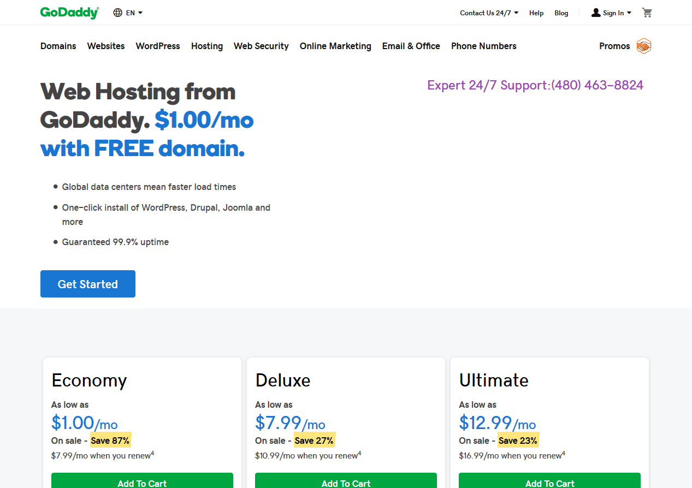

# python-google-ads-scraper

A small Python scraper built in 2019 to pull the top paid ads off Google SERP pages for a list of keywords, then use Selenium to screenshot each ad's landing page.

[](https://www.youtube.com/watch?v=MON9EEJzTdw)

> **Status:** v1 is preserved as a historical artifact. Google's SERP HTML has changed extensively since 2019 — the CSS selectors (`.ads-ad`, `.V0MxL`, `h3.sA5rQ`, `.ads-creative`) no longer match and `requests-html` is unmaintained. A v2 is in planning — see [Roadmap](#v2-roadmap).

## What it does

1. Reads a CSV of keywords ([`top-keywords.csv`](top-keywords.csv) — the 20 highest-CPC AdWords keywords of 2019).
2. For each keyword, hits `google.com/search?q=<keyword>` and extracts the four top paid ads via CSS selectors.
3. Records landing-page URL, headline, and ad copy to a timestamped CSV.
4. Spins up Firefox via Selenium and screenshots each landing page.

## Sample output

The 2019 run captured **98 landing pages across 20 keywords**. Example — a GoDaddy hosting ad:



- [`top-ads-1557428059.6068022.csv`](top-ads-1557428059.6068022.csv) — May 2019, 98 ads with headlines, copy, and landing-page URLs
- [`google_ads_screenshots/`](google_ads_screenshots/) — 98 landing-page screenshots (`0.png` – `97.png`)

## How it works

```python
session = HTMLSession()                           # requests-html (now unmaintained)
r = session.get(f'https://google.com/search?q={keyword}')
ads = r.html.find('.ads-ad')                      # 2019 Google SERP ad CSS class
for ad in ads:
    link = ad.find('.V0MxL', first=True).absolute_links
    headline = ad.find('h3.sA5rQ', first=True).text
    copy = ad.find('.ads-creative', first=True).text
    ad_list.append([keyword, link, headline, copy])
# Selenium + Firefox then screenshots each ad_link
```

Full script: [`google-ad.py`](google-ad.py) (40 lines).

## Why it worked then (and doesn't now)

- **2019:** Google returned ads inside the SERP HTML in plain CSS classes like `.ads-ad`. `requests-html` could fetch the page, render JS, and hand you a clean DOM.
- **2026:** Google's SERP is more aggressively JS-rendered, ad CSS classes rotate frequently, anti-automation defenses are stronger (captchas, fingerprinting), and `requests-html` is unmaintained.

A v1-style selector scrape would require continuous selector maintenance and likely wouldn't hold up for more than days at a time.

## v2 and the pivot

Initial v2 plan was a Playwright + stealth replacement of the 2019 Selenium scraper. Validation showed that's a losing battle in 2026: Google's anti-bot posture served a reCAPTCHA to headed real-Chrome + stealth on the second query, from a residential IP. Even with US-forced Apify datacenter proxies the `apify/google-search-scraper` returns zero paid ads on ~50% of commercial-intent queries. The SERP-scraping arms race is not a sensible place to invest portfolio time.

**The follow-up repo instead works from public ad-transparency data:**

→ **[nelsondooley/ad-library-analyzer](https://github.com/nelsondooley/ad-library-analyzer)** — Competitive ad intelligence from the Meta Ad Library (Facebook, Instagram, Threads, WhatsApp, Messenger). Fetch, normalize, analyze, visualize — with Apify's first-party scraper as the backend (pay-per-event, no rental fee). Ships with a 560-ad Shopify sample and four Plotly dashboards out of the box. A Google Ads Transparency Center backend is on that repo's roadmap.

The pivot gives richer data than SERP scraping ever could (spend tiers, reach estimates, variant counts, platform mix, AI-generated media flag, compliance signals) without fighting Google's bot walls.

## Repo contents

| File | Purpose |
|---|---|
| `google-ad.py` | Scraper script |
| `top-keywords.csv` | 20 high-CPC keywords (2019 AdWords benchmarks) |
| `top-ads-1557428059.6068022.csv` | May 2019 output — 98 ads |
| `google_ads_screenshots/` | 98 landing-page screenshots |

## License

MIT.
